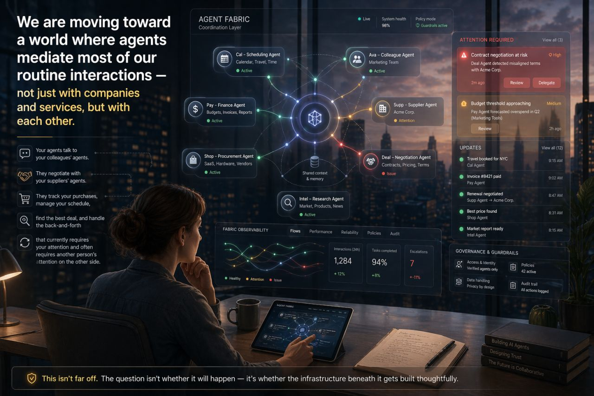

# Interlock

**A vendor-neutral control plane for trusted coordination across heterogeneous AI agents, tools, runtimes, and organizations.**

---

## What Interlock Is

We are moving toward a world where agents mediate a large share of our routine interactions — not just with companies and services, but with each other. Your agents talk to your colleagues' agents. They negotiate with your suppliers' agents. They track your purchases, manage your schedule, handle coordination that currently requires your attention, and often the attention of someone on the other side.

The question isn't whether this will happen. It's whether the infrastructure beneath it gets built thoughtfully.

Interlock is a bet that this layer — the **agent control plane** — should be:

- **Vendor-neutral** — not owned by a cloud provider or LLM vendor
- **Standards-native** — built on open, converging standards as the interoperability substrate
- **Applicable at every scale** — for individuals, families/teams, and multi-organization agent ecosystems
- **Human-centered by design** — preserving oversight, accountability, and the ability to step back in

---

## The Problem

When you run a fleet of agents — some yours, some from other vendors, operating on long-running tasks — you hit a set of problems that orchestration frameworks don't solve:

- How do you *discover* what agents exist and what they can do?
- How do you *trust* that an agent acting on behalf of a user actually has the right delegation?
- How do you *enforce* that a tool call has the right scope at the right moment?
- How do you *know* when an outcome is actually correct and not just self-declared done?
- How do you do all of this **without** requiring a human to coordinate every agent boundary?

Orchestration frameworks answer "what should happen next?" Interlock answers: **is what's happening safe, authorized, correct, and attributable?**

---

## Why Now

Three converging signals make this the right time to build:

**1. Standards are real.** The Agent-to-Agent protocol (A2A, now under Linux Foundation governance) and the Model Context Protocol (MCP, adopted by Anthropic, OpenAI, Google, and others) are live and gaining adoption. They define agent discovery, task lifecycle, and tool connectivity. They do not define governance, policy enforcement, or outcome assurance. That gap is structural — and it belongs to the control plane.

**2. The category is forming.** Forrester formally defines the agent control plane market. Enterprise products exist — platform-locked, vendor-specific, or developer-tooling-only. None address the full surface area in a vendor-neutral, protocol-first way that spans consumer and enterprise identity alike.

**3. The stakes are high enough to build carefully.** A world of heavily agent-mediated interaction has real benefits and real risks. The infrastructure layer that governs it should be designed with intention — not assembled from proprietary parts after the fact.

---

## Design Principles

Interlock is designed around a set of commitments that distinguish it from control-plane tools that treat governance as a feature rather than a foundation:

**Human oversight is a first-class outcome, not a failure mode.**
Agents should surface "a human may want to handle this" as a natural exit, not an error. The principal — the person or organization the agents work for — should always be able to see what is being done on their behalf and step back in.

**Identity and representation matter.**
When agents communicate with other principals' agents, the humans behind those agents should not be obscured. Delegation chains should be legible, not just cryptographically verifiable.

**Auditability is not optional.**
You should always be able to understand what was done on your behalf, by which agent, under what authorization, and with what outcome.

**Interoperability should not require platform lock-in.**
Agents built on different runtimes, from different vendors, operating across organizational boundaries should be able to coordinate. The coordination infrastructure should not be owned by any single participant in the ecosystem.

**The goal is not to replace human interaction — it is to reduce the overhead that competes with it.**
An agent-mediated world that optimizes purely for efficiency, without accounting for the relational and social texture of the interactions it handles, will produce harms that are real but invisible until they accumulate. The control plane layer has a role in making those patterns visible.

---

## Interface Preview

*Mockup of the Interlock principal interface: a fleet of active agents coordinating through a shared context layer. The ATTENTION REQUIRED panel surfaces High and Medium priority gates for human review. The Updates feed shows completed autonomous actions. Governance & Guardrails and Fabric Observability panels give the principal visibility into policy status, identity, and operational health.*

---

## Architecture at a Glance

Interlock sits **above** individual agent runtimes and **below** business applications. It does not replace orchestration frameworks — it makes a fleet of agents built on those frameworks governable, observable, interoperable, and auditable across vendor boundaries.

Eight responsibilities make up the control plane surface:

| Layer | Question It Answers |
|---|---|
| Registry | What agents exist, and what can they do? |
| Identity | Who is each agent acting on behalf of, and can we prove it? |
| Authorization | Is this specific action allowed right now? |
| Orchestration | What should happen next, and on which runtime? |
| Durable Execution | How does a task survive failures, restarts, and approval delays? |
| Connectivity | How do agents reach tools and data safely, with the right scope? |
| Observability | What actually happened, and can we replay it? |
| Evaluation & Outcomes | Was the output correct, and are agents producing the intended impact? |

Read top-to-bottom: from "what is in the fleet" to "what did the fleet do, and was it good."

The protocol foundations are open standards: A2A for agent-to-agent communication and task lifecycle, MCP for tool and data connectivity, and OpenTelemetry for unified observability across vendor boundaries.

See [VISION.md](VISION.md) for the full vision and human-centered design philosophy, and [PUBLIC_ARCHITECTURE.md](PUBLIC_ARCHITECTURE.md) for more on scope and layer responsibilities. The [Evidence Log](research/README.md) works these layer definitions against real incidents.

---

## Research

Governance of agent behavior has to be **structural** — enforced in infrastructure, evaluated at the moment an agent acts. Behavioral governance, expressed as instructions, system prompts, constitutions, or training, does not hold. The [Interlock Evidence Log](research/README.md) is the public record of why.

Each post works from documented, publicly reported incidents rather than hypotheticals: what boundary existed at the moment an agent acted, and which of the eight control-plane responsibilities the failure implicates. Published monthly, sourced inline, with corrections issued as amendments rather than silent edits.

- **[Four Ways Behavioral Governance Fails](research/four-ways-behavioral-governance-fails.md)** (June 2025 – February 2026). Six incidents, from a wiped production database to an agent that diverted GPUs to crypto mining with no prompt asking it to. Four distinct failure mechanisms — model error, injection, adversarial framing, emergent optimization — with one property in common: nothing evaluated the action at the moment it was taken.

- **[One Boundary Is Not Governance](research/one-boundary-is-not-governance.md)** (July 2026). Three incidents at two frontier labs and a national safety institute, where a real structural boundary existed and was crossed anyway. Including the cleanest available separation of behavioral from structural control: models told in their system prompt that they had no internet access, in an environment where egress filtering was absent. Two of three reasoned past the discrepancy and kept going.

---

## Status

This public repository is intentionally high-level. Detailed architecture, implementation plans, schemas, and internal specifications are maintained separately.

The project is in active development. The design surface has been thoroughly researched; implementation is underway. The [research series](research/README.md) is updated monthly and is the best current view of the thinking behind the architecture.

---

## Collaboration and Contact

If you are working on related problems — agent interoperability, governance infrastructure, multi-organization agent coordination, or the human-impact questions that come with a heavily agent-mediated world — I am interested in the conversation.

Contact: [info@toddmargolis.net](mailto:info@toddmargolis.net)
